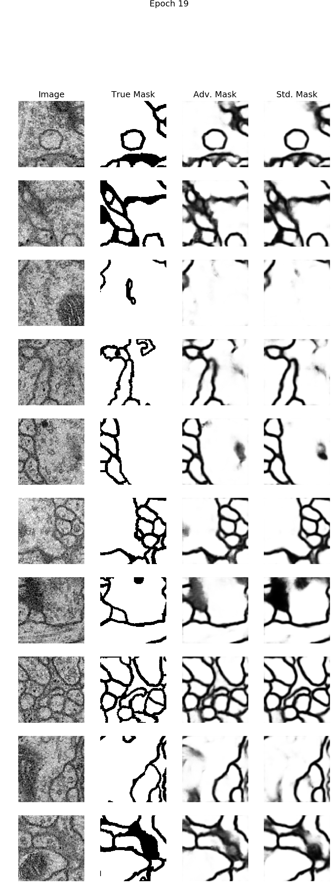

# Adversarial Image Segmentation

## Overview

In this mini-project I try out the concept of using adversarial training regimes for image segmentation. There is already research published on this, described below, but implementing it on your own is a great way to learn. Everything is implemented in Python 3.5 and Keras. In total I took about a week for this, and there are certainly improvements to be made. The experiment in its current state takes about 70 minutes to run on an NVIDIA GTX 1080.

See the script `examples/isbi_2012.py` to inspect the implementation and run the experiment.

See the `artifacts` directory to look at sample outputs after each epoch of training.

## Background

Generative adversarial networks have been a popular method in research circles since they were introduced in 2014 by [Goodfellow et. al.](https://arxiv.org/abs/1406.2661). Briefly stated, the method combines two networks: a generator *G* and a discriminator *D*. *G* generates images from noise vector inputs and *D* attempts to classify real-world images vs. images generated by *G*. As such, part of *G*'s objective is to maximize the number of mistakes made by *D* (*G* "tries" to "trick" *D*). I like to think *D* is performing a form of regularization on *G* by penalizing for non-realistic generated images.

Image segmentation is simply the task of classifying every pixel in an image as belonging to one class. A network performing segmentation on a 512x512 image is simply making 512x512=262,144 location-specific classifications comprising a single segmentation mask. Most of the state-of-the-art architectures follow an encoder-decoder structure and eliminate fully-connected operations at the output layers, making them *fully-convolutional*. One of the most popular architectures is the [fully-convolutional U-Net](https://arxiv.org/abs/1505.04597), which has been used extensively for biomedical segmentation tasks and [Kaggle image segmentation competitions](https://www.google.com/search?q=site%3Akaggle.com+UNet). I recently applied it fairly successfully to [segmentation for 2D calcium images and 1D calcium imaging time series](https://github.com/alexklibisz/deep-calcium).

Similar adversarial training regimes have recently been applied to semantic image segmentation by [Luc et. al](https://arxiv.org/abs/1611.08408) and biomedical image segmentation by [Xue et. al](https://link.springer.com/chapter/10.1007/978-3-319-66179-7_47). The approach by Luc et. al. works as follows. Instead of using a generator *G* to generate new images, a segmentation network *S* is used to create pixel-wise segmentation masks on input images. A discriminator *D* is trained to distinguish ground-truth segmentation masks vs. *S*'s outputs. The ground-truth masks are considered real and *S* outputs are considered fake. *S*'s loss is modified to also maximize the number of classification mistakes made by *D*. The approach by Xue et. al. is different in that *D* is trained to distinguish segmentation masks for annotated images vs. masks for un-annotated images. To me the approach by Luc et. al. is more intuitive, so that's the one I follow in my implementation.

Intuitively, a good discriminator *D* must learn to identify irregularities in the segmentation masks, forcing *S* to make its outputs more realistic. I personally find the idea of regularizing against irregularity particularly exciting for enforcing structural consistency and dealing with highly-imbalanced datasets. Consider two motivating examples. 

1. If the image domain consists primarily of circular shapes, *D* might penalize for rectangular segmentation shapes. This sort of penalty would otherwise be very difficult to implement as a custom loss function or regularization term. 
2. If the image domain is highly imbalanced, the optimizer can be susceptible to collapsing (i.e. predicting all one class because it gets fairly good performance). Typically this is addressed by carefully sampling balanced input data and adjusting learning rates. *D* might easily recognize that a collapsed segmentation mask is unrealistic and penalize in a way that allows the optimizer to recover or prevents it from collapsing in the first place.

## Dataset

I'm using the [2D Electron-Microscopy dataset from the ISBI 2012 Challenge](http://brainiac2.mit.edu/isbi_challenge/home), a very common benchmark dataset for segmentation. There are 30 512x512 images with ground-truth binary segmentation masks that distinguish cells from membranes. The dataset is small enough to keep in memory and train relatively quickly. Fully-convolutional architectures have generally been extremely successful for this task. I was able to make it inside the top 50 with a [fairly simple (albeit messy) U-Net implementation.](https://github.com/alexklibisz/isbi-2012)

For this task, I'm interested primarily in the pixel-wise [F1 metric for segmentation](https://en.wikipedia.org/wiki/F1_score). The competition uses more domain-specific metrics, which are initially difficult to interpret and difficult to implement in Keras.

## Network Architectures and Optimization

Segmentation Network *S*

- U-Net architecture with leaky ReLU's instead of regular ReLU's.
- Sigmoids at the last layer for 2-way classification.
- Trained to minimize binary crossentropy error (i.e. log-loss).
- Trained using RMSprop optimizer, based on [Drozdzal et. al.](https://arxiv.org/abs/1608.04117)

Discriminator network *D*

- First half of U-Net (i.e. the encoder) followed by single sigmoid activation for classification (ground-truth segmentation vs. *S* segmentation).
- Inputs are the raw outputs from *S* (range [0,1]) and the binary ground-truth masks. Both Luc and Xue made a point to try several more advanced forms of preparing the inputs to *D*.
- Trained using Adam optimizer to minimize binary crossentropy error.

"Generator" network *G*

- A combination of *S* and *D*, which enables combining the loss for segmentation and the loss for "tricking" *D*.
- The &lambda; parameter controls the weight of the loss term for tricking *D* in the overall loss (Luc equation 3). Based on Xue and some experimentation, I set &lambda;=0.1 for the first few epochs, and then increase it to 1.0. I also call it *alpha* in my code because `lambda` is a reserved Python token.

Training Regime

1. Train *S* by itself for 500 iterations; validate 100 iterations
2. Train *G* with *D*'s weights frozen for 500 iterations; validate 100 iterations.
3. Train *D* for 1000 iterations (500 real and 500 fake samples); validate 100 iterations; transfer *D*'s weights into *G*.
4. After the first couple epochs, increase the *lambda* value for *G*; re-compile *G*.
5. Repeat for a total of 10000 training iterations on each of the networks.

## ISBI Experiment Results

- In a real-world example of "your mileage may vary", I didn't find a clear improvement from using the adversarial training regime over regular training. I actually found the adversarial segmentation network (*G/S*) was slightly worse than the standard segmentation network (*S*). Of course, one could always try harder to tune hyper-parameters, try different loss functions, adjust training intervals for *G* and *D*, etc.

The plot above shows the following metrics for training and validation sets:

1. *S* F1 val/train - F1 for the standard segmentation network.
2. *G/S* F1 val/train - F1 for the adversarial segmentation network.
3. *D* Accuracy val/train - accuracy for the discriminator network.
4. *G/D* Accuracy val/train - accuracy in *tricking* the discriminator network while training *G*.

I notice the following trends:

1. *G/S* is consistently slightly worse than *S*.
2. *D* has some sudden drops in accuracy and is less stable than I'd like it to be. These sudden drops would suggest that *D* has suddenly gotten much worse at classifying real vs. fake segmentation masks.
3. *G/D* also has some sudden drops in accuracy but stays more stable over time.

I also plotted 10 validation samples after each epoch for qualitative evaluation. *Adv. Mask* is the output from *G/S*; "Std. Mask" is the output from *S*. Perhaps inspecting those coinciding with the sudden drops in accuracy would provide a better explanation. Below is the example from the final epoch.

## Main Challenges

- I initially struggled a long time with *D* collapsing (i.e. predicting all 0's or all 1's), so I observed the weight and bias distributions using Tensorboard. I found that the collapse corresponded to a very sudden shift in the bias terms in the last few convolutional layers, causing the inputs to the sigmoid to jump as high as +/-15000. This of course saturated the sigmoid to 0 or 1. Decreasing the learning rate by an order of magnitude delayed this collapse, but did not eliminate it. The only way I found to prevent the collapse was to add Batch Normalization layers to *D*. In hindsight, it might also make sense to just disable all of the bias terms when using Batch Normalization.
- I also had to duct-tape the Keras API a little bit to make training work well. For example, stateful callbacks (e.g. `DecreaseLROnPlateau`) don't seem to work when you are calling `.fit()` in a for-loop.

## Future Steps

I can think of some other datasets that would be worth trying. In general, the amoung and formatting of data for these would require better engineering and more training time.

1. [Kaggle DSTL Satelite Imagery](https://www.kaggle.com/c/dstl-satellite-imagery-feature-detection): Particularly interesting because it's a multi-class segmentation problem with several classes that might benefit from adversarial regularization of unrealistic segmentations. For example, *S*'s output might include a building inside a river. *D* should identify this as being bogus because it doesn't occur in any of the ground-truth masks.
2. [Kaggle Carvana Image Masking](https://www.kaggle.com/c/carvana-image-masking-challenge): In this case there are again some clear notions of regularity. There is only ever one car in the image, generally towards the middle of the image, the car will always have rounded wheels, etc.
3. [Kaggle Ultrasound Nerve Segmentation](https://www.kaggle.com/c/ultrasound-nerve-segmentation/data): Similar shape-based motivation.